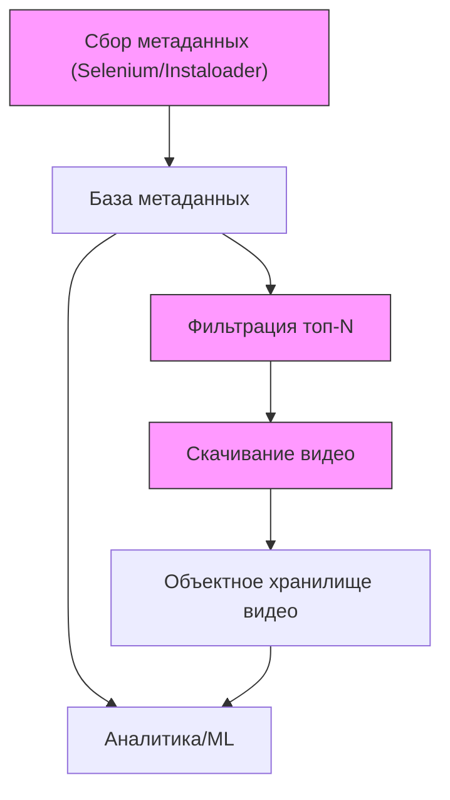

Отличный вопрос! Анализ данных по Reels — это ключ к пониманию своей аудитории и созданию контента, который действительно "залетает". Давайте разберем этот процесс по шагам: от сбора метрик до принятия решений.

### Шаг 1: Определите цели анализа

Прежде чем погружаться в цифры, спросите себя: **"Что я хочу узнать?"** Ваши цели могут быть разными:
*   **Увеличить охват и просмотры:** Понять, какие Reels становятся вирусными.
*   **Повысить вовлеченность:** Узнать, какой контент вызывает больше лайков, комментариев и сохранений.
*   **Привлечь целевую аудиторию:** Понять, что интересно именно вашим подписчикам (а не случайным зрителям).
*   **Увеличить продажи/переходы:** Отследить, какие Reels приводят к действиям (переход по ссылке в шапке, запрос в Direct).

### Шаг 2: Какие метрики Reels нужно отслеживать?

Метрики можно разделить на несколько групп. Самое главное — смотреть на них в комплексе.

#### 1. Метрики охвата (Насколько широко распространяется ваш контент)
*   **Охват (Reach):** **Самая важная метрика.** Показывает, сколько *уникальных* аккаунтов увидело ваш Reel. Это показатель роста и узнаваемости.
*   **Просмотры (Plays/Views):** Общее количество раз, когда ваш Reel был просмотрен. Эта цифра всегда будет больше или равна охвату, так как один человек может посмотреть видео несколько раз.
*   **Показы (Impressions):** Сколько раз ваш Reel появлялся на экранах пользователей. Не так важна, как охват, но полезна для понимания частоты показа.

#### 2. Метрики вовлеченности (Как аудитория реагирует на контент)
*   **Лайки (Likes):** Самый простой показатель одобрения.
*   **Комментарии (Comments):** Сигнал того, что контент вызвал дискуссию или эмоции.
*   **Сохранения (Saves):** **Ключевая метрика!** Показывает, что ваш контент настолько полезен или интересен, что люди хотят к нему вернуться. Instagram воспринимает сохранения как сильный сигнал ценности.
*   **Репосты/Поделиться (Shares):** Еще один мощный сигнал. Люди делятся тем, что считают важным, смешным или полезным для своих друзей. Это прямой путь к вирусному охвату.
*   **Engagement Rate (ER - Коэффициент вовлеченности):** Позволяет сравнивать эффективность Reels с разным охватом. Считается по формуле:
    `(Лайки + Комментарии + Сохранения + Репосты) / Охват * 100%`

#### 3. Метрики удержания (Насколько ваш контент интересен)
Эти данные доступны в статистике каждого отдельного Reel и критически важны.
*   **Среднее время просмотра (Average watch time):** Показывает, как долго в среднем люди смотрели ваш Reel. Чем выше этот показатель (в процентах от общей длины видео), тем лучше.
*   **График удержания аудитории (Audience retention graph):** Это золотая жила информации! Он показывает, в какой момент люди перестают смотреть видео.
    *   **Резкий спад в начале:** Ваш "хук" (первые 1-3 секунды) не сработал.
    *   **Плавное снижение:** Нормальная ситуация.
    *   **Резкий спад в середине:** Возможно, в этот момент стало скучно или информация была непонятной.
    *   **Пики (участки, которые пересматривают):** Обратите внимание на то, что именно происходит в эти моменты. Это самая ценная часть вашего видео.

---

### Шаг 3: Как и где собирать данные?

#### Метод 1: Встроенная статистика Instagram (для всех)

Это самый простой и доступный способ. **Важно:** у вас должен быть **профессиональный аккаунт** (бизнес-аккаунт или аккаунт автора).

1.  **Статистика конкретного Reel:**
    *   Откройте нужный Reel.
    *   Нажмите на три точки (...) в правом нижнем углу.
    *   Выберите **"Посмотреть статистику" (View Insights)**.
    *   Здесь вы увидите все перечисленные выше метрики для этого одного видео.

2.  **Общая статистика (Professional Dashboard):**
    *   Зайдите в свой профиль.
    *   Нажмите **"Профессиональная панель" (Professional Dashboard)**.
    *   Перейдите в раздел **"Статистика аккаунта" (Account Insights)**.
    *   Здесь можно посмотреть общие данные по охвату и вовлеченности за выбранный период (7, 14, 30, 90 дней) и увидеть самые популярные Reels.

#### Метод 2: Ручной анализ в таблицах (для систематизации)

Для глубокого анализа встроенной статистики недостаточно. Создайте простую таблицу в Google Sheets или Excel.

| Дата | Тема/Идея Reel | Формат (туториал, юмор, говорящая голова) | Аудио (тренд/оригинал) | Призыв к действию (CTA) | Просмотры | Охват | Лайки | Комментарии | Сохранения | Репосты | ER (%) |
| :--- | :--- | :--- | :--- | :--- | :--- | :--- | :--- | :--- | :--- | :--- | :--- |
| 01.10 | Как выбрать авокадо | Туториал, польза | Трендовый звук | "Сохрани, чтобы не потерять" | 150k | 120k | 5k | 150 | 2k | 300 | 6.2% |
| 03.10 | Смешной случай на работе | Юмор, скетч | Оригинальный звук | "У кого было так же?" | 50k | 45k | 4k | 500 | 100 | 80 | 10.4% |
| ... | ... | ... | ... | ... | ... | ... | ... | ... | ... | ... | ... |

**Зачем это нужно?**
Такая таблица позволяет сортировать данные и находить закономерности:
*   Какие **темы** получают больше всего сохранений?
*   Какой **формат** видео приносит максимальный охват?
*   Влияет ли **трендовая музыка** на просмотры в вашей нише?
*   Работают ли ваши **призывы к действию**?

#### Метод 3: Сторонние сервисы аналитики (для профессионалов)

Сервисы вроде **Later, Iconosquare, Sprout Social** автоматически собирают данные, строят красивые отчеты, позволяют анализировать конкурентов и отслеживать динамику за долгий период. Обычно они платные, но экономят много времени.

---

### Шаг 4: Как интерпретировать данные и делать выводы (Цикл анализа)

Это самый важный этап.

1.  **Соберите данные** за определенный период (например, за месяц) в вашу таблицу.
2.  **Определите "победителей" и "аутсайдеров"**. Отсортируйте таблицу по ключевой для вас метрике (например, по сохранениям, если ваша цель — польза, или по охвату, если цель — виральность). Выделите топ-3 и худшие 3 Reels.
3.  **Сравните их и задайте себе вопросы:**
    *   **Хук (первые 3 секунды):** Чем отличались первые секунды у самых успешных видео? Это был вопрос? Яркая картинка? Интригующий заголовок?
    *   **Формат:** Какой формат победил? Быстрый монтаж, "говорящая голова", туториал, эстетичное видео?
    *   **Тема:** Какие темы больше всего "зашли" аудитории?
    *   **Аудио:** Помог ли трендовый звук или лучше сработал оригинальный?
    *   **Призыв к действию (CTA):** Был ли CTA в успешных видео? Какой именно? ("Напиши в комментах", "Сохрани", "Подпишись").
    *   **Описание и хэштеги:** Были ли какие-то особенности в описании?
    *   **Посмотрите на график удержания:** Где люди теряли интерес в неуспешных видео? Что их цепляло в успешных?
4.  **Сформулируйте гипотезы.** На основе анализа выдвиньте предположения.
    *   *Гипотеза 1:* "Моей аудитории больше нравятся короткие обучающие видео (до 15 секунд) с текстовыми субтитрами, чем юмористические скетчи".
    *   *Гипотеза 2:* "Reels, опубликованные во вторник в 18:00, получают больший стартовый охват".
5.  **Проверьте гипотезы.** Создайте новый контент на основе ваших выводов.
6.  **Повторите цикл.** Анализ — это не разовая акция, а постоянный процесс улучшения.

Регулярно проводя такой анализ, вы перестанете действовать вслепую и начнете создавать контент, который системно достигает ваших целей.

Отлично, это задача совершенно другого уровня, требующая системного подхода и команды специалистов. Вы правильно определили роли: здесь нужен синергетический эффект от Data Engineering, Data Science, ML Engineering и Software Engineering.

Разработаем комплексный роадмап и технологический стек для создания такой аналитической платформы.

---

### **Цель проекта: "Reels Intelligence Platform"**

Создать автоматизированную систему, которая:
1.  Собирает данные о большом количестве Reels из разных ниш.
2.  Анализирует контент (видео, аудио, текст).
3.  Выявляет факторы, коррелирующие с виральностью (высокий охват, ER).
4.  Автоматически определяет и классифицирует текущие тренды (аудио, форматы, челленджи).
5.  Предоставляет инсайты и рекомендации в виде удобного дашборда или API.

---

### **Роадмап проекта**

Проект логично разбить на итеративные фазы, от MVP к полнофункциональной системе.

#### **Phase 0: Foundation & MVP (1-2 месяца)**

**Цель:** Собрать базовый датасет, провести первичный разведочный анализ (EDA) и проверить основные гипотезы на ограниченном наборе данных.

*   **Data Engineering (DE):**
    1.  **Настройка сбора данных (Data Collection):**
        *   **Источник:** Instagram Graph API (для авторизованных аккаунтов) и/или разработка парсеров/сканеров для сбора публичных данных ( **Внимание:** высокий риск блокировки, нарушение ToS Instagram).
        *   **Что собираем:** Метаданные Reels (ID, ссылка, лайки, комменты, просмотры, дата публикации, автор), метаданные автора (подписчики, категория аккаунта), текст описания, хэштеги.
        *   **Задача:** Создать скрипты для сбора данных по списку аккаунтов или хэштегов.
    2.  **Настройка хранилища (Data Storage):**
        *   **Реляционная БД (e.g., PostgreSQL):** для хранения метаданных.
        *   **Объектное хранилище (e.g., AWS S3, MinIO):** для сохранения сырых видео- и аудиофайлов.
    3.  **Создание базового ETL/ELT пайплайна:** Скрипт, который регулярно (e.g., раз в день) собирает новые Reels и складывает данные в хранилище.

*   **Data Science / Data Analysis (DS/DA):**
    1.  **Разведочный анализ (EDA):**
        *   Используя Jupyter Notebooks, Pandas, Matplotlib/Seaborn, проанализировать собранные метаданные.
        *   Найти базовые корреляции: Зависимость ER от числа подписчиков? Влияние количества хэштегов? Время публикации?
    2.  **Определение "успешности":** Формализовать метрику успеха. Например, `virality_score = (просмотры / подписчики автора) * (сохранения / лайки)`. Это не просто просмотры, а относительный успех.
    3.  **Формулировка гипотез для следующей фазы.**

*   **Результат фазы:** Рабочий прототип сбора данных, база с ~10,000-50,000 Reels, отчет с первыми инсайтами и четко сформулированными вопросами для глубокого анализа.

---

#### **Phase 1: Content Feature Extraction (2-3 месяца)**

**Цель:** "Оцифровать" контент. Извлечь из видео, аудио и текста числовые признаки (features) для машинного обучения.

*   **Data Engineering (DE) & ML Engineering (MLE):**
    1.  **Расширение ETL-пайплайна:** Интеграция ML-моделей для обработки каждого нового видео.
    2.  **Пайплайн обработки видео:**
        *   **Технический анализ:** Длина, разрешение, FPS.
        *   **Визуальный анализ:** Детекция смены сцен (оценка динамики монтажа), детекция лиц и эмоций, детекция объектов, **OCR (Optical Character Recognition)** для извлечения текста с видео.
    3.  **Пайплайн обработки аудио:**
        *   **Распознавание речи (Speech-to-Text):** Получение полной текстовой транскрипции видео.
        *   **Идентификация музыки (Audio Fingerprinting):** Определение используемого трека. Критически важно для поиска трендов.
        *   **Разделение на музыку/речь.**
    4.  **Пайплайн обработки текста (NLP):**
        *   Анализ описания и транскрипции: определение тональности (sentiment analysis), тематическое моделирование (topic modeling), извлечение ключевых слов.

*   **Data Science (DS):**
    1.  **Feature Engineering:** Создание единого "векторного представления" для каждого Reel на основе всех извлеченных признаков.
    2.  **Создание первой предиктивной модели:**
        *   **Задача:** Бинарная классификация (`is_viral` / `is_not_viral`) или регрессия (предсказание `virality_score`).
        *   **Модели:** Начать с градиентного бустинга (XGBoost, LightGBM, CatBoost) — они мощные и хорошо интерпретируемые.
    3.  **Анализ важности признаков (Feature Importance):** Первые ответы на вопрос "почему". Что важнее для виральности: динамика монтажа, наличие улыбающегося лица в кадре или использование определенной темы?

*   **Результат фазы:** Расширенная база данных с векторными признаками для каждого Reel. Рабочая модель, предсказывающая успех видео с определенной точностью. Отчет о самых влиятельных факторах.

---

#### **Phase 2: Automated Trend Detection & Causal Inference (2-3 месяца)**

**Цель:** Перейти от анализа отдельных видео к анализу экосистемы. Найти и классифицировать тренды в реальном времени.

*   **Data Science (DS) & ML Engineering (MLE):**
    1.  **Алгоритмы детекции трендов:**
        *   **Аудио-тренды:** Кластеризация аудио-фингерпринтов. Если кластер резко растет в популярности (количество использований в день) — это тренд.
        *   **Визуальные/форматные тренды:** Кластеризация видео по их визуальным признакам (e.g., "говорящая голова", "туториал с текстом", "скетч с быстрой сменой ролей"). Отслеживание популярности кластеров во времени.
        *   **Тренды-челленджи/мемы:** Комбинированный анализ. Поиск аномалий в совместном использовании определенных аудио, хэштегов и ключевых слов в транскрипции.
    2.  **Система классификации трендов:** Разработать модель (возможно, с элементами ручной разметки), которая присваивает тренду категорию (e.g., "танец", "юмор", "экспертный контент", "липсинк").
    3.  **Причинно-следственный анализ (Causal Inference):**
        *   Использование техник вроде **SHAP, LIME** для объяснения предсказаний модели для *конкретного* видео. Ответ на вопрос "Почему *этот* рилс не взлетел?".
        *   Более сложные методы (e.g., Propensity Score Matching) для попытки оценить, какой был бы охват у видео, если бы в нем, например, использовался другой звук.

*   **Результат фазы:** Алгоритм, который в автоматическом режиме выдает список текущих трендов (аудио, форматы) с описанием и аналитикой. Возможность "прогнать" любой Reel

Отлично. Подход "с чистого листа" — самый правильный для задачи такого масштаба. Разработаем комплексный, структурированный план для создания **"Reels Intelligence Platform"**.

### **Миссия проекта**

Создать автоматизированную платформу, которая переходит от корреляций к причинно-следственным связям, чтобы отвечать на три ключевых вопроса:
1.  **"Почему?"** — Почему конкретный Reel стал (или не стал) виральным?
2.  **"Что сейчас?"** — Какие тренды (аудио, форматы, темы) доминируют в данный момент?
3.  **"Что дальше?"** — Какие рекомендации можно дать для создания следующего успешного Reel?

---

### **Роадмап: От данных к продукту**

Проект делится на четыре логические фазы с четкими целями и результатами.

#### **Phase 0: Foundation & Data Acquisition (Срок: 1-2 месяца)**

**Цель:** Создать надежную и масштабируемую инфраструктуру для сбора и хранения данных. Это фундамент всего проекта. Без качественных данных все остальное бессмысленно.

**Задачи и ответственные:**

*   **1. Разработка стратегии сбора данных (DE, Legal):**
    *   **Путь А (Официальный):** Использование **Instagram Graph API**.
        *   *Плюсы:* Легально, стабильно.
        *   *Минусы:* Ограниченный доступ, требует авторизации от владельцев аккаунтов, может быть дорого.
    *   **Путь Б (Альтернативный):** Разработка собственных парсеров/сканеров (веб-скрейпинг).
        *   *Плюсы:* Доступ к любым публичным данным.
        *   *Минусы:* Высокий риск блокировок IP и аккаунтов, нарушение ToS Instagram, требует постоянной поддержки из-за изменений в верстке сайта.
    *   **Решение:** Гибридный подход. Использовать API для "дружественных" аккаунтов и крайне осторожный скрейпинг для анализа общей экосистемы.

*   **2. Построение Data Lake (DE):**
    *   Создать централизованное хранилище для сырых данных.
    *   **Инструменты:** **AWS S3** или **Google Cloud Storage** для хранения видео, аудио и JSON с метаданными.
    *   **Структура:** `s3://reels-platform/raw/video/YYYY/MM/DD/reel_id.mp4`

*   **3. Разработка ETL/ELT пайплайнов (DE):**
    *   Создать автоматизированные процессы для извлечения, первичной обработки и загрузки данных.
    *   **Инструменты:** **Apache Airflow** или **Prefect** для оркестрации. Скрипты на **Python** (библиотеки `requests`, `Selenium`, `Scrapy`).

*   **4. Разведочный анализ данных (DA/DS):**
    *   Провести первичный анализ собранных метаданных для подтверждения базовых гипотез.
    *   **Задача:** Определить и формализовать метрику успеха (`ViralityScore`), например: `(Просмотры / Подписчики) * (ER)`.
    *   **Инструменты:** **Jupyter Notebooks**, **Pandas**, **Seaborn**.

**Результат фазы:**
*   Стабильный поток данных (~10,000+ новых Reels в день) в Data Lake.
*   Рабочий ETL-пайплайн.
*   Отчет с первыми инсайтами и четко определенной целевой метрикой для моделей.

---

#### **Phase 1: Content Feature Extraction (Срок: 2-3 месяца)**

**Цель:** Превратить "неструктурированный" контент (видео, аудио, текст) в "структурированные" числовые признаки (фичи), понятные для машин.

**Задачи и ответственные:**

*   **1. Пайплайн обработки видео (MLE/DE):**
    *   **Технические фичи:** Длительность, FPS, разрешение.
    *   **Визуальные фичи:**
        *   **Детекция смены сцен:** Оценка динамики монтажа (OpenCV).
        *   **Распознавание текста на видео (OCR):** Извлечение заголовков и плашек (EasyOCR, PaddleOCR).
        *   **Детекция объектов и лиц:** Наличие людей, эмоций (MediaPipe, YOLO).
        *   **Создание векторных эмбеддингов:** "Сжатие" смысла видео в вектор (CLIP, InceptionV3).

*   **2. Пайплайн обработки аудио (MLE/DE):**
    *   **Транскрибация речи (Speech-to-Text):** Получение текста из голоса (OpenAI Whisper).
    *   **Идентификация музыки (Audio Fingerprinting):** Создание уникального "отпечатка" трека для поиска трендов (Dejavu или аналоги).
    *   **Анализ аудио:** Темп (BPM), наличие/отсутствие речи.

*   **3. Пайплайн обработки текста (DS/MLE):**
    *   **Анализ описания и транскрипции:**
        *   **Тематическое моделирование (Topic Modeling):** Определение тем (BERTopic).
        *   **Анализ тональности (Sentiment Analysis).**
        *   **Извлечение сущностей (NER).**

*   **4. Создание Feature Store (DE/MLE):**
    *   Централизованное хранилище готовых фичей для быстрого доступа при обучении моделей и инференсе.
    *   **Инструменты:** **Feast**, **Tecton** или самописное решение на базе Redis/PostgreSQL.

**Результат фазы:**
*   Масштабируемые пайплайны, обогащающие каждый Reel десятками или сотнями фичей.
*   Feature Store, готовый к использованию.

---

#### **Phase 2: Predictive Modeling & Trend Detection (Срок: 2-3 месяца)**

**Цель:** Создать модели, предсказывающие успех, и алгоритмы, автоматически обнаруживающие тренды.

**Задачи и ответственные:**

*   **1. Разработка предиктивной модели "виральности" (DS):**
    *   **Задача:** Обучить модель (регрессию или классификацию) на данных из Feature Store для предсказания `ViralityScore`.
    *   **Модели:** **XGBoost, LightGBM, CatBoost**. Провести эксперименты с нейросетями (TabNet).
    *   **Инструменты для трекинга экспериментов:** **MLflow**, **Weights & Biases**.

*   **2. Анализ важности факторов (DS):**
    *   Использовать **SHAP** и **LIME** для интерпретации моделей. Это даст первые ответы на вопрос "почему". Например: "Успех этого видео на 30% обусловлен быстрым монтажом и на 20% — наличием трендовой музыки".

*   **3. Разработка алгоритмов детекции трендов (DS/MLE):**
    *   **Аудио-тренды:** Кластеризация аудио-фингерпринтов. Отслеживание скорости роста размера кластеров. Резкий рост = тренд.
    *   **Визуальные/форматные тренды:** Кластеризация видео-эмбеддингов (CLIP). Аналогично отслеживать динамику кластеров.
    *   **Тренды-челленджи:** Поиск аномальных всплесков совместного использования определенных хэштегов, ключевых слов из транскрипции и аудио-кластеров.

**Результат фазы:**
*   Продуктовая ML-модель с точностью > N% (цель определяется на старте).
*   Система, которая в реальном времени генерирует список трендов с аналитикой (скорость роста, охват).

---

#### **Phase 3: Productization & Delivery (Срок: 2-4 месяца)**

**Цель:** Упаковать всю аналитику и модели в удобный продукт для конечного пользователя.

**Задачи и ответственные:**

*   **1. Разработка Backend API (SWE):**
    *   Создать API-эндпоинты, которые будут:
        *   Принимать ссылку на Reel и возвращать полный анализ и прогноз виральности.
        *   Отдавать список актуальных трендов.
        *   Предоставлять историческую аналитику.
    *   **Инструменты:** **FastAPI** (Python) для быстрой разработки ML-сервисов, **Django/Flask** для более комплексных приложений.

*   **2. Разработка Frontend (Дашборд) (SWE):**
    *   Создать интерактивный веб-интерфейс для визуализации данных.
    *   **Разделы:** "Анализатор Reels", "Радар Трендов", "Аналитика по нишам".
    *   **Инструменты:** **React**, **Vue.js**, **Svelte**. Библиотеки для графиков: **D3.js**, **Chart.js**.

*   **3. Настройка MLOps (MLE/DevOps):**
    *   Автоматизировать весь цикл: от сбора данных и переобучения моделей до их развертывания (CI/CD для ML).
    *   **Инструменты:** **Kubernetes/KubeFlow** для оркестрации контейнеров, **Docker**, **Jenkins/GitLab CI**.

**Результат фазы:**
*   Работающий MVP продукта (веб-приложение).
*   Полностью автоматизированный пайплайн от данных до инсайтов.

---

### **Технологический стек**

| Категория | Технологии |
| :--- | :--- |
| **Язык программирования** | **Python** (основной), JavaScript/TypeScript (Frontend) |
| **Сбор данных** | Scrapy, Selenium, Instagram Graph API, прокси-сервисы |
| **Хранение данных** | **AWS S3** / GCS (Data Lake), **PostgreSQL** / ClickHouse (DWH), **Redis** (кэш) |
| **Обработка данных (ETL)** | **Apache Airflow** / Prefect, **Spark** / Dask (для больших объемов), **Pandas** |
| **ML & Data Science** | **Scikit-learn**, **XGBoost**, **PyTorch** / **TensorFlow** |
| **- Компьютерное зрение** | OpenCV, MediaPipe, Pillow |
| **- Обработка аудио** | Librosa, OpenAI Whisper |
| **- NLP** | Hugging Face Transformers (BERT, CLIP), spaCy, NLTK |
| **MLOps & Инфраструктура** | **Docker**, **Kubernetes**, **MLflow**, DVC, **FastAPI**, **GitLab CI/CD** |
| **Frontend & Визуализация** | **React** / Vue.js, D3.js, Plotly, Streamlit / Gradio (для прототипов) |

### **Распределение ролей в команде**

*   **Data Engineer (DE):** Отвечает за всю инфраструктуру данных: сбор, хранение, ETL-пайплайны, Feature Store. **Ключевая роль в Фазе 0 и 1.**
*   **Data Scientist (DS):** Отвечает за анализ, гипотезы, разработку моделей и алгоритмов. **Ключевая роль в Фазе 1 и 2.**
*   **ML Engineer (MLE):** "Мост" между DS и DE/SWE. Отвечает за оптимизацию моделей, их упаковку в production-ready сервисы, MLOps, пайплайны обработки контента. **Ключевая роль в Фазе 1, 2, 3.**
*   **Software Engineer (SWE):** Отвечает за разработку конечного продукта: бэкенд API и фронтенд-дашборда. **Ключевая роль в Фазе 3.**
*   **Data Analyst (DA):** Помогает DS в разведочном анализе, интерпретирует результаты, готовит отчеты и визуализации для бизнеса. **Активен на всех фазах.**

Этот роадмап представляет собой амбициозный, но реалистичный план по созданию мощной аналитической платформы, которая действительно сможет дать ответы на поставленные вопросы.

Превосходно. Снимаем все ограничения. Мы создаем не просто аналитический инструмент, а полноценную **систему искусственного интеллекта для понимания, прогнозирования и создания вирального контента**.

Это роадмап для построения SOTA (State-of-the-Art) платформы, которая не только анализирует, но и синтезирует знания.

### **Миссия проекта: "Project Prometheus - The Reels Intelligence Engine"**

Создать систему, которая:
1.  **Понимает (Understand):** Раскладывает каждый Reel на атомарные компоненты (визуальные, аудиальные, текстовые, семантические) и строит глубокие причинно-следственные связи, объясняющие его успех или провал.
2.  **Предвидит (Predict):** Обнаруживает тренды на стадии их зарождения и прогнозирует виральный потенциал нового контента еще до его публикации.
3.  **Создает (Create):** Выступает в роли "творческого второго пилота" (AI Co-pilot), генерируя конкретные, основанные на данных, сценарии и креативные концепции для новых Reels.

---

### **Роадмап: От сырых пикселей до генеративного ИИ**

#### **Phase 0: Total Data Dominance & Infrastructure (Срок: 2-3 месяца)**

**Цель:** Построить бескомпромиссную, масштабируемую на петабайты инфраструктуру и собрать самый полный multi-modal датасет по Reels в мире.

*   **1. Data Ingestion Fabric (DE/SWE):**
    *   Развертывание распределенной сети для скрейпинга (на базе **Kubernetes** с **Scrapy**/**Playwright**). Тысячи ротируемых прокси, User-Agent'ов, поведенческая эмуляция для обхода самых сложных защит.
    *   Прямая интеграция через **Instagram Graph API** для получения ground-truth данных от партнеров.
    *   **Real-time Firehose:** Подписка на потоки данных от сервисов-партнеров (если возможно) для получения информации о новых Reels в реальном времени.

*   **2. Multi-Modal Data Lakehouse (DE):**
    *   **Архитектура:** Lakehouse на базе **Databricks Delta Lake** или **Apache Hudi** на **S3/GCS**. Сочетает гибкость Data Lake и производительность Data Warehouse.
    *   **Хранение:**
        *   **Сырые данные:** Видео (4K), аудио (lossless), JSON метаданных, HTML-снапшоты страниц.
        *   **Бронзовый слой:** Очищенные, дедуплицированные данные.
        *   **Серебряный слой:** Обогащенные данные с извлеченными фичами.
        *   **Золотой слой:** Агрегированные витрины данных для BI и ad-hoc анализа.

*   **3. Feature Store on Steroids (MLE/DE):**
    *   Развертывание **Feast** или **Tecton**. Будет служить единым источником истины для фичей как для онлайн-инференса (real-time prediction), так и для оффлайн-обучения (model training).

**Результат:** Непрерывный поток миллионов Reels в день, хранящийся в структурированной, готовой к анализу форме. Это "нефть" для всего проекта.

---

#### **Phase 1: Deep Multi-Modal Feature Extraction (Срок: 3-4 месяца)**

**Цель:** Применить ансамбль SOTA Deep Learning моделей для "цифровой диссекции" каждого Reel.

*   **1. Visual Cortex (Компьютерное зрение) (MLE/RS):**
    *   **Семантическое понимание:** Использование pre-trained **CLIP** или **Florence (Microsoft)** для генерации плотных векторных эмбеддингов, описывающих *смысл* видео.
    *   **Анализ динамики:** **Optical Flow** модели для оценки скорости и типа движения в кадре. Трансформерные модели (e.g., **TimeSformer**) для анализа временной структуры видео.
    *   **Эстетическая оценка:** Обучение конволюционной сети для оценки эстетических качеств кадра (композиция, цветовая гармония, освещение).
    *   **Детекция всего:** **YOLOv8** / **Detectron2** для детекции объектов, **MediaPipe** для анализа лиц, поз, жестов.

*   **2. Auditory Cortex (Анализ аудио) (MLE/RS):**
    *   **Транскрипция:** **OpenAI Whisper (large model)** для SOTA-качества распознавания речи.
    *   **Идентификация музыки:** Разработка собственного или использование open-source решения для **Audio Fingerprinting** (создание хэшей аудио).
    *   **Анализ просодии:** Анализ интонации, темпа, громкости и эмоциональной окраски речи.
    *   **Музыкальная семантика:** Использование моделей (e.g., **Jukebox by OpenAI**) для получения эмбеддингов музыкальных треков, описывающих их жанр, настроение и сложность.

*   **3. Language Cortex (NLP) (DS/RS):**
    *   **Глубокое понимание текста:** Использование **LLM (Large Language Models)**, например, дообученного **BERT** или **GPT-моделей**, для анализа описаний, комментариев и транскрипций. Задачи: анализ сарказма, выявление скрытых призывов к действию, определение структуры повествования (завязка, кульминация, развязка).

**Результат:** Для каждого Reel создан богатейший multi-modal вектор, состоящий из сотен или тысяч числовых признаков. Пайплайны обработки полностью автоматизированы и работают в потоковом режиме.

---

#### **Phase 2: Causal & Predictive Intelligence (Срок: 3-4 месяца)**

**Цель:** Перейти от корреляций ("что связано с успехом") к каузальности ("что является причиной успеха") и создать систему семантического поиска.

*   **1. Causal Inference Engine (RS/DS):**
    *   **Задача:** Ответить на вопрос "Что было бы, если...?"
    *   **Подходы:**
        *   **Мета-алгоритмы:** S-learner, T-learner, X-learner, использующие модели машинного обучения (e.g., XGBoost) для оценки **Conditional Average Treatment Effect (CATE)**. Например, каков эффект добавления трендового звука для экспертного контента по сравнению с юмористическим?
        *   **Deep Causal Models:** Использование нейросетевых архитектур (e.g., **CEVAE, Dragonnet**) для одновременного моделирования связей между фичами и оценкой каузальных эффектов.

*   **2. Trend Detection as a Graph Problem (DS/MLE):**
    *   Представить экосистему Reels как гигантский гетерогенный граф: узлы — это Reels, пользователи, звуки, хэштеги, темы. Ребра — это "использовал", "лайкнул", "прокомментировал".
    *   **Задача:** Найти быстрорастущие, плотно связанные подграфы. Это и есть тренды.
    *   **Технологии:** **Graph Neural Networks (GNNs)**, алгоритмы community detection (Louvain) в динамике. **Neo4j** или **TigerGraph** для хранения и обработки графа.

*   **3. Deep Learning for Search & Discovery (MLE/SWE):**
    *   **Задача:** Создать "Google для Reels".
    *   **Технология:** Использование multi-modal эмбеддингов из Фазы 1. Загрузка их в **векторную базу данных** (**Pinecone**, **Weaviate**, **Milvus**).
    *   **Возможности:** Пользователь может искать на естественном языке: "покажи мне туториалы по макияжу с эстетикой 90-х и спокойной lo-fi музыкой". Система найдет релевантные видео, даже если в их описании нет этих слов.

**Результат:** Ядро системы, которое не просто предсказывает, а *объясняет* успех. Алгоритмы, находящие тренды за часы, а не дни. Уникальная возможность семантического поиска по всему датасету.

---

#### **Phase 3: The Generative Co-Pilot (Срок: 4-6 месяцев)**

**Цель:** Создать продукт, который помогает творить, а не просто анализировать.

*   **1. The "ReelForge" Engine (RS/MLE):**
    *   **Архитектура:** Ядром является **LLM** (e.g., GPT-4 или fine-tuned LLaMA/Mistral), который выступает в роли "режиссера".
    *   **Процесс:**
        1.  **Промпт от пользователя:** "Хочу сделать виральный Reel про моего кота, который ворует еду со стола".
        2.  **RAG (Retrieval-Augmented Generation):** LLM не фантазирует, а обращается к нашим системам из Фазы 2:
            *   *Запрос к Trend Engine:* "Какие звуки/форматы сейчас в тренде для категории 'животные' и 'юмор'?"
            *   *Запрос к Causal Engine:* "Для такой темы, какой монтажный ритм и текстовый хук максимизируют удержание аудитории?"
            *   *Запрос к Vector Search:* "Найди мне примеры успешных Reels на похожую тему".
        3.  **Синтез сценария:** На основе полученных данных LLM генерирует детализированный, раскадрованный сценарий:
            > **Сценарий "Кот-гурман" (Прогноз ViralityScore: 8.7/10)**
            > *   **Звук:** [Ссылка на трендовый звук #1]
            > *   **Длительность:** 12 секунд.
            > *   **Кадр 1 (0-2 сек):** Крупный план. Текст на экране: "Вы думаете, ваш кот милый?". Эффект "slow zoom".
            > *   **Кадр 2 (2-5 сек):** Смена кадра в бит музыки. Кот сидит на столе рядом с тарелкой. Текст: "А мой — профессиональный вор".
            > *   **Кадр 3 (5-10 сек):** Серия быстрых нарезок (0.5-1 сек на кадр) под смешные моменты, где кот пытается стащить разную еду.
            > *   **Кадр 4 (10-12 сек):** Кот сидит с невинным видом. Текст: "И я ничего не могу доказать". Призыв к действию в описании: "У кого так же? Делитесь в комментах!"

*   **2. Optimization Loop (RS/MLE):**
    *   Рассматривать генерацию сценария как **задачу оптимизации**, где целевая функция — максимизация предсказанного `ViralityScore`.
    *   **Подходы:** **Reinforcement Learning from AI Feedback (RLAIF)**, где модель-награду обучают на наших данных о виральности, или **генетические алгоритмы** для "эволюции" наилучшего сценария из сотен вариантов.

**Результат:** Интерактивный AI-ассистент, который является не просто инструментом, а полноценным творческим партнером для создания контента.

### **Технологический стек (SOTA-версия)**

| Категория | Технологии |
| :--- | :--- |
| **Инфраструктура/Оркестрация** | Kubernetes, Terraform, Databricks, Airflow |
| **Хранилище** | AWS S3, Delta Lake, Snowflake/BigQuery, Neo4j, **Pinecone/Weaviate** |
| **Deep Learning Frameworks** | **PyTorch** (основной), JAX (для R&D) |
| **Модели (Foundation Models)** | **CLIP, Whisper, GPT-4/LLaMA, TimeSformer, YOLO, GNNs** |
| **Causal Inference** | **EconML (Microsoft)**, CausalML, DoWhy |
| **MLOps** | MLflow, DVC, KubeFlow, Triton Inference Server (NVIDIA) |
| **Backend/Frontend** | Go/Rust (для high-performance бэкенда), FastAPI, React/Svelte |
| **Команда** | DE, MLE, SWE, DA + **Research Scientists (RS)** с PhD в CV/NLP/Causal Inference. |

Отличный уточняющий вопрос. Определение трендов — это одна из самых сложных и динамичных задач в проекте. "Тренд" — это не просто популярный звук, а комплексное явление. Мы будем использовать многоуровневый подход, чтобы детектировать и классифицировать тренды максимально полно.

### **Философия подхода: Тренд как аномальный всплеск когерентной активности**

Ключевая идея в том, что тренд — это не статическое свойство, а **динамический процесс**. Мы ищем не просто "самые популярные" элементы, а те, чья **популярность (и связанность с другими элементами) растет аномально быстро**.

Вот как мы будем это делать, разбивая задачу на компоненты тренда:

---

### **1. Детекция аудио-трендов**

Это самый очевидный и важный тип тренда.

*   **Шаг 1: Создание "ДНК" звука (Audio Fingerprinting)**
    *   **Подход:** Для каждого уникального аудиодорожки из Reels мы создаем компактный и устойчивый к шумам "отпечаток" (фингерпринт). Это не просто хэш файла, а хэш, основанный на спектрограмме аудио.
    *   **Технологии:** Можно использовать готовые библиотеки, такие как **`dejavu`**, или реализовать собственный алгоритм на основе пиков в спектрограмме (похожий на тот, что использует Shazam). Каждый фингерпринт сохраняется в базе данных вместе с `audio_id`.

*   **Шаг 2: Анализ временных рядов (Time Series Analysis)**
    *   **Подход:** Для каждого уникального `audio_id` мы строим временной ряд: количество его использований в час/день.
    *   **Детекция аномалий:** Мы не просто ищем звуки с самым большим количеством использований. Мы ищем **точки перегиба** и **резкий рост**.
    *   **Технологии:**
        *   **Скользящие средние (Moving Averages):** Сравниваем краткосрочное скользящее среднее (e.g., за 3 дня) с долгосрочным (e.g., за 14 дней). Если краткосрочное резко пересекает долгосрочное снизу вверх — это сильный сигнал зарождения тренда.
        *   **Статистические тесты:** Использование алгоритмов обнаружения аномалий, таких как **Seasonal-Hybrid ESD (S-H-ESD)** от Twitter, который хорошо работает с сезонными данными (например, спад активности ночью).
        *   **Прогнозирование и отклонение:** Обучаем простую модель временных рядов (e.g., **Prophet** или **ARIMA**) на исторических данных для каждого звука. Если реальное количество использований значительно превышает прогноз — это аномалия, т.е. тренд.

*   **Шаг 3: Классификация жизненного цикла тренда**
    *   **Подход:** На основе формы кривой временного ряда мы классифицируем тренд:
        *   **Зарождающийся (Emerging):** Низкое абсолютное число использований, но очень высокая скорость роста (первая производная).
        *   **На пике (Peaking):** Высокое абсолютное число, рост замедляется (вторая производная отрицательна).
        *   **Угасающий (Fading):** Абсолютное число все еще высокое, но уже падает.
        *   **Нишевый/Вечнозеленый (Niche/Evergreen):** Стабильное, но невысокое использование на протяжении долгого времени.

---

### **2. Детекция визуальных и форматных трендов**

Это сложнее, так как форматы более абстрактны. Здесь нам помогут векторные представления.

*   **Шаг 1: Векторизация визуального ряда (Video Embeddings)**
    *   **Подход:** Мы уже извлекли эмбеддинги для каждого видео с помощью моделей вроде **CLIP** или **TimeSformer** (Фаза 1 роадмапа). Эти векторы кодируют семантику и стиль видео.

*   **Шаг 2: Динамическая кластеризация (Dynamic Clustering)**
    *   **Подход:** Мы не можем просто один раз кластеризовать все видео. Форматы меняются. Мы запускаем кластеризацию на данных за каждый день/неделю.
    *   **Технологии:**
        *   Используем алгоритмы, которые не требуют заранее заданного числа кластеров, например **DBSCAN** или **HDBSCAN**. Они найдут плотные "сгустки" похожих друг на друга видео в векторном пространстве. Каждый такой сгусток — это потенциальный визуальный формат (e.g., "говорящая голова на фоне книжной полки", "эстетичная нарезка путешествий под музыку", "туториал с текстом поверх").
        *   **Присвоение ID кластерам:** Мы должны понимать, что кластер #5 на этой неделе — это тот же формат, что и кластер #8 на прошлой. Для этого мы сравниваем центроиды (или медоиды) кластеров между временными срезами.

*   **Шаг 3: Анализ временных рядов для кластеров**
    *   **Подход:** Аналогично аудио-трендам, для каждого кластера (визуального формата) мы строим временной ряд его "мощности" (количества видео в нем). И применяем те же методы детекции аномального роста.

---

### **3. Детекция комплексных трендов (мемов, челленджей)**

Это высший пилотаж. Мем — это не просто звук или видео, а **комбинация** элементов, которая распространяется вместе.

*   **Шаг 1: Построение графа ко-активности (Co-occurrence Graph)**
    *   **Подход:** Здесь вступает в игру **графовый подход**. Мы строим гетерогенный граф, где узлы — это `reel_id`, `audio_id`, `hashtag_id`, `user_id`, а также `topic_id` (из NLP-анализа) и `visual_cluster_id`.
    *   Ребра соединяют узлы, если они появились вместе в одном Reel. Вес ребра — частота их совместного появления.

*   **Шаг 2: Поиск плотных, быстрорастущих подграфов (Community Detection in Dynamic Graphs)**
    *   **Подход:** Тренд/челлендж в этой модели — это **плотное сообщество** в графе, которое быстро растет. Например, внезапно появляется множество Reels, где одновременно используются:
        1.  Один и тот же `audio_id`.
        2.  Один и тот же `hashtag_id` (e.g., `#WednesdayDance`).
        3.  Похожие `visual_cluster_id` (люди, повторяющие танец).
        4.  Похожие ключевые слова в транскрипции ("танец Уэнсдей").
    *   **Технологии:**
        *   Применение алгоритмов **Community Detection** (e.g., Louvain, Leiden, Label Propagation) на срезах графа по времени.
        *   Отслеживание "жизни" сообществ во времени. Если сообщество резко увеличивается в размере (привлекает новые узлы) — это и есть наш комплексный тренд.
        *   **Graph Neural Networks (GNNs)** могут быть использованы для предсказания роста связей в графе, то есть для предсказания зарождения трендов.

*   **Шаг 3: "Именование" тренда (Trend Naming & Summarization)**
    *   **Подход:** Когда мы нашли такой плотный подграф, нам нужно дать ему человекопонятное имя.
    *   **Технологии:** Мы передаем в **LLM (GPT/Llama)** все компоненты тренда:
        *   Самые частые хэштеги в кластере.
        *   Ключевые слова из транскрипций самых популярных видео в кластере.
        *   Описание 3-5 репрезентативных видео.
        *   Название трендового аудио.
    *   **Промпт для LLM:** `"На основе этих данных, опиши суть этого тренда в одном предложении и дай ему короткое название. Категоризируй его (танец, юмор, челлендж, туториал и т.д.)"`
    *   **Результат:** "Название: Челлендж 'Танец Уэнсдей'. Суть: Пользователи повторяют вирусный танец из сериала 'Уэнсдей' под песню Lady Gaga 'Bloody Mary'. Категория: Танец, Поп-культура."

### **Итоговая архитектура системы детекции трендов:**

1.  **Потоковая обработка:** Новые Reels поступают в систему.
2.  **Feature Extractor:** Из них извлекаются фингерпринты аудио, видео-эмбеддинги, текст, хэштеги.
3.  **Time Series DB:** Данные о частоте использования аудио и визуальных кластеров обновляются в реальном времени (e.g., в **ClickHouse** или **TimescaleDB**).
4.  **Anomaly Detector:** Отдельный сервис постоянно сканирует эти временные ряды на предмет аномального роста.
5.  **Graph Database:** Данные о связях (ко-активности) обновляются в графовой БД (e.g., **Neo4j**).
6.  **Community Detector:** Периодически (раз в несколько часов) запускается алгоритм поиска сообществ в графе.
7.  **Trend Synthesizer & Namer (LLM-based):** Когда аномалия найдена, этот сервис собирает всю информацию и генерирует полное описание тренда.
8.  **Trends Dashboard/API:** Результаты отправляются в дашборд и становятся доступны через API.

Этот многоуровневый подход позволяет нам не просто находить "популярные песни", а понимать всю сложную, многокомпонентную природу современных интернет-трендов.

Понимаю. Предыдущая схема была концептуальной. Давайте создадим **максимально детализированную, многоуровневую архитектурную диаграмму**, которая покажет не только компоненты, но и форматы данных, передаваемых между ними.

Эта схема отражает архитектуру SOTA-уровня, где каждый модуль имеет четко определенную зону ответственности и производит конкретные артефакты.

### **Философия новой схемы**

*   **Явные потоки данных:** На стрелках будет указано, *какие именно данные* передаются.
*   **Детализация компонентов:** Внутри блоков будут перечислены ключевые технологии и производимые сущности.
*   **Разделение процессов:** Четко разделены потоки для обучения моделей (offline), реального времени (online), пакетной обработки (batch) и взаимодействия с пользователем.
*   **Иерархия:** Использование вложенных блоков для логической группировки.

### **Код Mermaid.js (Детализированная версия)**

```mermaid
graph TD
    %% =================================================================
    %% 1. INGESTION & RAW STORAGE LAYER
    %% =================================================================
    subgraph 1. Data Ingestion & Raw Zone
        direction LR
        A1[🌐 Instagram Public Feeds] --> A3{Collector Fleet};
        A2[🔑 Instagram Graph API] --> A3;
        A3 -- Unstructured Data --> A4[Broker: Kafka / Pulsar];
        A4 --> A5[Raw Data Ingestion Service];
        A5 -- Raw Files & Metadata --> A6[🌊 Data Lake (S3/GCS)<br><i>/raw-zone/</i>];
    end

    %% =================================================================
    %% 2. DATA ENGINEERING & FEATURE ENGINEERING PIPELINE (BATCH)
    %% =================================================================
    subgraph 2. Batch Processing & Feature Engineering
        B1[Orchestrator: Airflow / Prefect] -- Triggers Job --> B2[Processing Engine: Spark / Ray];
        A6 -- Reads Raw Data --> B2;

        subgraph B3[Multi-Modal Feature Extraction Workers]
            direction TB
            B2 -- Video --> B3a[🎥 Visual Cortex<br><b>Outputs:</b><br>- CLIP/ImageBind Embeddings<br>- Object BBoxes<br>- OCR Text<br>- Scene Cut Timestamps];
            B2 -- Audio --> B3b[🎧 Auditory Cortex<br><b>Outputs:</b><br>- Whisper Transcriptions<br>- Audio Fingerprints<br>- Music/Speech Segments<br>- BPM, Loudness];
            B2 -- Metadata/Text --> B3c[📝 Language Cortex<br><b>Outputs:</b><br>- BERT/LLM Embeddings<br>- Topics (BERTopic)<br>- Sentiments, Entities (NER)];
        end
        
        B3a -- Extracted Features --> B4{Feature Aggregator};
        B3b -- Extracted Features --> B4;
        B3c -- Extracted Features --> B4;

        subgraph B5[Structured & Specialized Storage]
            direction TB
            B4 -- Vector Embeddings --> B5a[🗂️ Vector DB<br>(Pinecone, Weaviate)];
            B4 -- Time Series Data --> B5b[⏱️ Time Series DB<br>(ClickHouse, Timescale)];
            B4 -- Graph Relationships --> B5c[🕸️ Graph DB<br>(Neo4j, TigerGraph)];
            B4 -- All Features & Metadata --> B5d[🏛️ Data Warehouse / Lakehouse<br>(Snowflake / BigQuery / Delta Lake)<br><i>/gold-zone/</i>];
        end
    end

    %% =================================================================
    %% 3. INTELLIGENCE ENGINE (THE BRAIN) - OFFLINE & ONLINE
    %% =================================================================
    subgraph 3. Intelligence Engine
        
        subgraph 3A. Offline Model Training
            B5d -- Labeled Training Data --> C1[🧪 Model Training & Experiment Tracking<br>(MLflow, W&B)];
            C1 -- Learns from --> C2[🤖 Predictive & Causal Models<br>(XGBoost, EconML, PyTorch)];
            C1 -- Publishes --> C3[📦 Model Registry];
        end

        subgraph 3B. Real-time & Near Real-time Intelligence
            C3 -- Loads Model --> D1[🧠 Real-time Inference Service<br>(Triton / KServe)];
            B5a -- Live Features --> D1;
            D1 -- Predictions & Explanations --> E1;
            
            subgraph D2[Trend Detection Engine]
                direction TB
                D2a[📈 Anomaly Detector on Time Series DB] -- Anomaly Signals --> D2c{💡 Trend Synthesizer (LLM)};
                D2b[🕸️ Community Detector on Graph DB] -- Community Growth Signals --> D2c;
                D2c -- Formatted Trend Object --> E1;
            end
        end

        subgraph 3C. Generative Intelligence (AI Co-Pilot)
            E2 -- User Prompt --> D3[🎬 ReelForge Engine (LLM + RAG)];
            D3 -- Asks for Context --> D2;
            D3 -- Asks for Predictions --> D1;
            D3 -- Retrieves Examples --> B5a;
            D3 -- Generated Scenario Object --> E1;
        end
    end

    %% =================================================================
    %% 4. APPLICATION & DELIVERY LAYER
    %% =================================================================
    subgraph 4. Application Layer
        E1[🚀 Backend API (FastAPI / Go)];
        E1 -- Serves Data --> E2[🖥️ Frontend Dashboard (React/Vue)];
        
        subgraph E3[User Interactions]
            direction TB
            E3a[Analyze Reel URL] --> E2;
            E3b[Browse Trend Radar] --> E2;
            E3c[Generate Script Idea] --> E2;
        end

        E4[👤 User] -- Interacts via --> E3;
        E2 -- API Calls --> E1;
    end
    
    %% =================================================================
    %% DATA FLOWS & CONNECTIONS
    %% =================================================================
    B5b --> D2a;
    B5c --> D2b;
    
    %% STYLING
    classDef user fill:#d4ffc4,stroke:#0b8000,stroke-width:2px;
    classDef external fill:#ffc4c4,stroke:#b00,stroke-width:2px;
    classDef storage fill:#fff2c4,stroke:#b08600,stroke-width:2px;
    classDef brain fill:#c4d7ff,stroke:#003cb0,stroke-width:2px;
    class E4 user;
    class A1,A2 external;
    class A6,B5a,B5b,B5c,B5d storage;
    class D1,D2,D3,C1,C2,C3 brain;
```

### **Визуализация и объяснение схемы**

Эта диаграмма гораздо более насыщена информацией. Давайте пройдемся по ключевым потокам.

1.  **Поток данных (сверху вниз):**
    *   **Сбор (Блок 1):** Данные из Instagram поступают в очередь (Kafka), затем сервис `Ingestion Service` складывает сырые файлы и JSON в `Data Lake (raw-zone)`.
    *   **Пакетная обработка (Блок 2):** `Airflow` по расписанию запускает `Spark`-джобы. Эти джобы берут сырые данные, пропускают их через три "коры" (визуальную, аудиальную, языковую), которые извлекают конкретные фичи (эмбеддинги, BPM, темы и т.д.).
    *   **Специализированное хранение:** Извлеченные фичи не сваливаются в одну кучу. `Feature Aggregator` распределяет их по специализированным базам: векторы — в `Vector DB`, временные ряды использований — в `Time Series DB`, связи — в `Graph DB`, а полная "золотая" таблица для аналитики — в `Data Warehouse`.

2.  **Поток интеллекта (Блок 3 - Мозг Системы):**
    *   **Обучение (3A - Offline):** На исторических данных из DWH (`B5d`) обучаются модели (предсказательные, каузальные). Результат — `Model Artifact`, который сохраняется в `Model Registry`. Это происходит периодически (например, раз в неделю).
    *   **Анализ в реальном времени (3B - Online):**
        *   **Предсказания:** `Inference Service` загружает последнюю модель из реестра. Когда ему нужны фичи для нового Reel, он берет их из баз данных (в первую очередь, из векторной) и выдает мгновенный прогноз.
        *   **Тренды:** `Trend Detection Engine` работает в фоне. `Anomaly Detector` постоянно следит за `Time Series DB`. `Community Detector` периодически анализирует `Graph DB`. Если они находят сигналы, `Trend Synthesizer` (на базе LLM) превращает эти сигналы в человекопонятный `Trend Object` (e.g., `{name: "Sad Hamster", type: "Meme", velocity: "9.8/10"}`).
    *   **Генерация (3C - Co-Pilot):**
        *   Пользовательский запрос ("сделай смешной рилс про кота") поступает в `ReelForge Engine`.
        *   Движок выполняет **RAG (Retrieval-Augmented Generation)**: он обращается к другим модулям за контекстом ("какие тренды про котов сейчас есть?", "какой прогноз виральности у этой идеи?"), а затем генерирует сценарий.

3.  **Поток взаимодействия (Блок 4 - Продукт):**
    *   Пользователь взаимодействует не с базой данных, а с красивым `Frontend`.
    *   Все действия пользователя (анализ, просмотр трендов) превращаются в `API-вызовы` к `Backend`.
    *   `Backend` является шлюзом ко всей сложной системе в Блоке 3, оркеструя запросы к разным интеллектуальным сервисам и возвращая результат на фронтенд.

Эта схема представляет собой полноценный blueprint для команды инженеров и ученых, детализируя не только "что делать", но и "как и с помощью чего".

Отличный вопрос, который проникает в самую суть проблемы! Использование графовой базы данных (Graph DB) — это не просто техническое усложнение, а **ключевое стратегическое преимущество** для понимания сложных, неявных связей, которые невозможно эффективно смоделировать в традиционных реляционных или документных базах.

Вот почему графовая БД является критически важным компонентом нашей "Reels Intelligence Platform":

### 1. Моделирование **отношений** как сущностей первого класса

В мире социальных сетей **отношения между сущностями так же важны, как и сами сущности**.

*   **Реляционная модель (SQL):** Фокусируется на сущностях (таблицы `reels`, `users`, `sounds`). Связи реализуются через внешние ключи (`user_id` в таблице `reels`). Чтобы найти сложные связи, приходится писать громоздкие, медленные `JOIN`'ы на множество таблиц.
*   **Графовая модель:** Фокусируется на двух вещах одновременно:
    *   **Узлы (Nodes):** Это наши сущности (`Reel`, `User`, `Sound`, `Hashtag`, `Topic`, `VisualFormat`).
    *   **Ребра (Edges / Relationships):** Это связи между ними, которые могут иметь свои свойства. `(User)-[POSTED]->(Reel)`, `(Reel)-[USED_SOUND]->(Sound)`, `(User)-[LIKED]->(Reel)`.

**Пример:** Найти "всех пользователей, которые лайкнули Reels с трендовым звуком X, но при этом сами не использовали этот звук" в SQL — это кошмар из нескольких JOIN'ов и подзапросов. В графовом запросе (например, на языке Cypher для Neo4j) это выглядит почти как английское предложение и выполняется на порядки быстрее.

```cypher
// Найти пользователей, которые лайкнули Reels со звуком X, но не постили Reels с этим же звуком
MATCH (u:User)-[:LIKED]->(r:Reel)-[:USED_SOUND]->(s:Sound {id: "sound_X_id"})
WHERE NOT (u)-[:POSTED]->(:Reel)-[:USED_SOUND]->(s)
RETURN DISTINCT u.username
```

### 2. Обнаружение **комплексных трендов и сообществ**

Это главная причина. Простые тренды (один популярный звук) можно отследить и без графов. Но настоящие, "вирусные" тренды — это сложные комбинации.

*   **Что такое мем или челлендж?** Это не просто звук. Это **плотно связанное сообщество** узлов:
    *   Определенный `Sound`.
    *   Определенный `VisualFormat` (например, "человек указывает на текст по бокам").
    *   Определенные `Hashtag`'и.
    *   Ключевые слова из `Topic`'ов ("мой красный флаг", "pov").
    *   Все это начинает использоваться вместе **аномально часто**.

Графовая БД идеально подходит для **Community Detection**. Алгоритмы (Louvain, Leiden, Label Propagation) могут быть запущены прямо на базе данных для поиска этих плотных кластеров. В реляционной базе такая задача практически невыполнима эффективно. Мы можем буквально "увидеть", как формируется и растет новый тренд в виде нового плотного подграфа.

### 3. **Рекомендательные системы и семантический поиск** нового уровня

Графы позволяют создавать более умные рекомендации.

*   **Коллаборативная фильтрация на графах:** Мы можем легко находить похожих пользователей или контент, просто "гуляя" по графу. "Пользователи, похожие на тебя (лайкали те же Reels), также лайкали вот эти Reels, которые ты еще не видел". Это классика, но на графах она реализуется естественнее и быстрее.
*   **Объяснимые рекомендации:** Мы можем не просто порекомендовать Reel, но и объяснить почему: "Мы рекомендуем этот Reel, потому что ты подписан на автора, тебе нравится звук, который в нем используется, и он популярен среди пользователей в твоей тематической нише ('программирование')".

### 4. Анализ **распространения и влияния (Influence Analysis)**

Графы — это стандарт де-факто для анализа сетей.

*   **Поиск "супер-распространителей" (Superspreaders):** Кто те пользователи, чьи лайки или репосты приводят к максимальному каскадному эффекту? Используя алгоритмы центральности (PageRank, Betweenness Centrality), мы можем найти не просто пользователей с большим количеством подписчиков, а тех, кто является "мостом" между разными сообществами и эффективно распространяет информацию.
*   **Отслеживание пути виральности:** Мы можем буквально проследить путь, как Reel стал вирусным. `User A` запостил -> `User B` (инфлюенсер) лайкнул -> его подписчики `C`, `D`, `E` увидели и тоже лайкнули -> алгоритм Instagram подхватил и показал в рекомендациях тысячам других.

### **Итог: Зачем нам графовая БД?**

| Проблема | Решение в графовой БД | Почему это невозможно (или очень сложно) в SQL |
| :--- | :--- | :--- |
| **Поиск сложных, непрямых связей** | Короткие, быстрые запросы, следующие по ребрам | Медленные, дорогие `JOIN`'ы на множество таблиц |
| **Детекция мемов и челленджей** | Алгоритмы Community Detection находят плотные подграфы (звук+формат+хэштег) | Нет нативного способа моделировать и анализировать "плотность" связей |
| **Анализ влияния и распространения** | Встроенные алгоритмы центральности (PageRank) и поиска путей | Требует выгрузки данных во внешние инструменты и сложных вычислений |
| **Умные, объяснимые рекомендации** | Естественная реализация "прогулок" по графу для поиска похожего контента/пользователей | Требует сложных самописных алгоритмов и множества запросов |

Без графовой базы данных мы бы видели лес, но не видели бы тропинок, связывающих деревья. Мы бы знали, какие Reels популярны, но не понимали бы, **как именно** и **почему** их популярность распространяется по сети. Это переход от "что" к "как" и "почему".

Хорошо, погружаемся на уровень ниже. Создадим низкоуровневую архитектуру с фокусом на конкретные сервисы, их взаимодействие, используемые протоколы и форматы данных. Это "схема для инженеров".

### **Принципы низкоуровневой архитектуры**

*   **Микросервисный подход:** Каждый компонент — это независимый, контейнеризированный сервис со своим API.
*   **Асинхронность:** Максимальное использование асинхронных очередей сообщений для decoupling'а и масштабируемости.
*   **gRPC для внутреннего взаимодействия:** Для высокопроизводительного общения между сервисами внутри кластера.
*   **REST/GraphQL для внешнего API:** Для гибкости и удобства клиентской разработки.
*   **Явные форматы данных:** Protobuf для gRPC, JSON для REST/Kafka.

---

### **Низкоуровневая архитектурная схема (Mermaid.js)**

```mermaid
graph TD
    subgraph Kubernetes Cluster: "Prometheus"
        
        %% ======================= INGESTION FLOW =======================
        subgraph Ingestion Namespace: "ingest"
            A1[External: Instagram Feeds] -- HTTP/S --> A2[Collector Service (Go/Rust)<br><i>HPA-scaled Pods</i>];
            A2 -- JSON: {reel_id, url, metadata} --> A3[Message Broker: Kafka Topic "raw_reels"];
        end

        %% ======================= PROCESSING FLOW (EVENT-DRIVEN) =======================
        subgraph Processing Namespace: "processing"
            B1[ETL Service (Python/Faust)<br><i>Consumes "raw_reels"</i>] -- Downloads Video/Audio --> B2[Object Storage: S3/MinIO];
            B1 -- Triggers Feature Extraction via gRPC --> B3;

            subgraph Feature Extraction Services (Python/Go)
                direction LR
                B3 -- gRPC: ExtractFeatures(video_path) --> B4a[Visual Extractor Service<br><i>GPU-enabled Node</i>];
                B3 -- gRPC: ExtractFeatures(audio_path) --> B4b[Audio Extractor Service];
                B3 -- gRPC: ExtractFeatures(text_data) --> B4c[Language Extractor Service];
            end

            B4a -- Protobuf: VisualFeatures --> B5{Feature Sink Service};
            B4b -- Protobuf: AudioFeatures --> B5;
            B4c -- Protobuf: LanguageFeatures --> B5;
            
            B5 -- Writes to... --> B6[Data Persistence Layer];
        end

        subgraph Data Persistence Layer
            direction LR
            B6 -- Vectors --> C1[Vector DB: Milvus/Weaviate<br><i>gRPC/REST API</i>];
            B6 -- Events/TimeSeries --> C2[Time Series DB: ClickHouse<br><i>TCP/HTTP API</i>];
            B6 -- Relationships --> C3[Graph DB: Neo4j<br><i>Bolt/HTTP API</i>];
            B6 -- Master Data --> C4[Relational DB: PostgreSQL<br><i>SQL Connection</i>];
        end

        %% ======================= INTELLIGENCE FLOW (BATCH & REAL-TIME) =======================
        subgraph Intelligence Namespace: "intelligence"
            D1[Scheduler: Airflow/Argo Workflows] -- Triggers periodic jobs --> D2;

            subgraph Batch Jobs
                D2[Model Trainer Job (PyTorch)] -- Reads from C4, C1 --> D2;
                D2 -- Writes to --> D3[Model Registry (MLflow/S3)];
                
                D4[Trend Analyzer Job (Spark/Python)] -- Reads from C2, C3 --> D4;
                D4 -- Writes results to --> C4;
            end
            
            subgraph Online Services
                D5[Inference Service (Python/Triton)<br><i>Loads model from D3</i>] -- gRPC API --> E1;
                D6[Trend Service (Go/Python)<br><i>Reads from C4</i>] -- gRPC API --> E1;
                D7[Generative Service (Python/FastAPI)<br><i>LLM + RAG Logic</i>] -- gRPC API --> E1;
            end
        end
        
        %% ======================= APPLICATION FLOW =======================
        subgraph Application Namespace: "api"
            E1[API Gateway / BFF (Go/Node.js)<br><i>GraphQL/REST API</i>] -- Aggregates data from... --> D5;
            E1 --> D6;
            E1 --> D7;
            E1 -- Serves... --> E2[External: Frontend App];
            E3[External: User] --> E2;
        end
    end

    %% Styling
    classDef service fill:#c4d7ff,stroke:#003cb0,stroke-width:2px;
    classDef external fill:#d4ffc4,stroke:#0b8000,stroke-width:2px;
    classDef storage fill:#fff2c4,stroke:#b08600,stroke-width:2px;
    class A2,B1,B4a,B4b,B4c,B5,D1,D2,D4,D5,D6,D7,E1 service;
    class A1,E2,E3 external;
    class A3,B2,C1,C2,C3,C4,D3 storage;
```

### **Объяснение низкоуровневых потоков**

#### **Поток 1: Прием нового Reel (Ingestion Flow)**

1.  **Collector Service (A2):** Высокопроизводительный сервис на Go/Rust, который занимается исключительно сбором данных. Он получает URL или ID, парсит страницу/API и формирует простое JSON-сообщение.
2.  **Kafka (A3):** Сообщение немедленно отправляется в топик `raw_reels`. Это развязывает сборщик и обработчик. Сборщик может умереть, но данные не потеряются. Kafka выдерживает пиковые нагрузки.

#### **Поток 2: Обработка и извлечение признаков (Processing Flow)**

1.  **ETL Service (B1):** Легковесный сервис на Python (с библиотекой `Faust` или `kafka-python`), который слушает топик `raw_reels`. Его задачи:
    *   Скачать видео и аудио в **S3/MinIO (B2)**.
    *   Вызвать три специализированных сервиса для извлечения фичей через **gRPC**. Он не делает тяжелой работы сам, а только оркеструет.

2.  **Feature Extraction Services (B4a, B4b, B4c):**
    *   Это "рабочие лошадки". Каждый сервис отвечает за свой тип данных. `Visual Extractor` крутится на нодах с GPU.
    *   Они получают на вход путь к файлу в S3, выполняют тяжелые вычисления и возвращают структурированный ответ в формате **Protobuf**.

3.  **Feature Sink Service (B5):** Единая точка входа для сохранения фичей. Он получает Protobuf-сообщения от экстракторов и знает, как правильно "разложить" данные по разным базам данных **(C1-C4)**. Это упрощает логику экстракторов.

#### **Поток 3: Генерация Интеллекта (Intelligence Flow)**

*   **Офлайн-часть (D1-D4):**
    *   **Airflow/Argo (D1)** по расписанию (например, каждую ночь) запускает `Kubernetes Jobs`.
    *   **Model Trainer Job (D2):** Запускается в отдельном Pod, читает терабайты данных из хранилищ, обучает модель и сохраняет артефакт в **Model Registry (D3)**. После выполнения Pod умирает.
    *   **Trend Analyzer Job (D4):** Аналогично, запускается Pod, который выполняет тяжелые графовые расчеты и анализ временных рядов, а затем сохраняет "снапшот" трендов в **PostgreSQL (C4)** для быстрого доступа.

*   **Онлайн-часть (D5-D7):**
    *   Это долгоживущие сервисы.
    *   **Inference Service (D5):** При старте загружает последнюю модель из реестра. Предоставляет один gRPC-метод `Predict(features)`.
    *   **Trend Service (D6):** Очень быстрый сервис, который просто читает уже посчитанные тренды из PostgreSQL.
    *   **Generative Service (D7):** Сервис с LLM, который для генерации сценария сам делает gRPC-вызовы к другим сервисам (`Inference`, `Trend`).

#### **Поток 4: Взаимодействие с пользователем (Application Flow)**

1.  **API Gateway / BFF (E1):** Это "фасад" для всей системы. Фронтенд общается только с ним.
    *   Если пользователь хочет проанализировать Reel, Gateway делает один вызов к `Inference Service`.
    *   Если пользователь открывает дашборд трендов, Gateway делает вызов к `Trend Service`.
    *   Если пользователь запрашивает генерацию сценария, Gateway делает вызов к `Generative Service`.
    *   Он собирает ответы от всех внутренних сервисов и формирует единый JSON-ответ для фронтенда. Использование **GraphQL** здесь идеально, так как клиент может запросить только те данные, которые ему нужны.

Этот подход обеспечивает максимальную **масштабируемость, отказоустойчивость и ремонтопригодность**. Если, например, `Visual Extractor` упадет, это не затронет другие части системы, а сообщения для него будут накапливаться в Kafka, ожидая его восстановления.

---

## Способы получения и анализа чужих Reels (особое внимание — неофициальные методы)

### 1. Официальные способы

- **Graph API для Instagram**: Доступен только для бизнес/автор-аккаунтов, ограничен публичной информацией и требует разрешения владельца. Можно искать посты по хэштегу, но нельзя массово анализировать чужие личные аккаунты или получать аналитику по рилсам.
- **oEmbed API**: Позволяет получить метаданные по публичному посту, если известен прямой URL. Не подходит для массового анализа.

### 2. Неофициальные/обходные способы (Web Scraping)

- **Описание:**
  - Веб-скрейпинг — это программный сбор данных с публичных страниц Instagram (например, через Python-библиотеки: Selenium, Playwright, Instaloader, BeautifulSoup).
  - Позволяет массово собирать данные о рилсах с любых публичных аккаунтов и по хэштегам: подписи, просмотры, лайки, комментарии, ссылки на видео и др.

- **Плюсы:**
  - Нет ограничений по типу аккаунта (можно собирать данные с любых публичных профилей).
  - Гибкость: можно автоматизировать сбор по хэштегам, трендам, спискам пользователей.

- **Минусы и риски:**
  - Нарушение пользовательского соглашения Instagram (ToS), возможна блокировка IP/аккаунта.
  - Instagram активно борется с ботами: капчи, rate limit, динамическая верстка.
  - Нет доступа к приватным аккаунтам и внутренней аналитике.
  - Возможны юридические последствия при коммерческом использовании.

- **Инструменты:**
  - [Instaloader](https://instaloader.github.io/) (Python, CLI)
  - Selenium/Playwright (автоматизация браузера)
  - Собственные парсеры на Python (BeautifulSoup, requests)

- **Рекомендации по легальности и этике:**
  - Не используйте скрейпинг для приватных аккаунтов или обхода приватности.
  - Соблюдайте лимиты запросов, не злоупотребляйте автоматизацией.
  - Для коммерческих проектов — по возможности использовать официальные API и получать разрешения.
  - Уважайте права пользователей и законы о защите данных.

### 3. Сторонние сервисы аналитики

- Сервисы типа Popsters, HypeAuditor, SocialBlade, Analisa.io предоставляют аналитику по чужим аккаунтам, но только по публичным данным и часто платно.

---

**Вывод:**
- Для массового анализа чужих рилсов единственный реально рабочий способ — веб-скрейпинг публичных аккаунтов, с пониманием всех рисков и ограничений.
- Официальные API подходят только для анализа своих аккаунтов или с разрешения владельца.
- Для легального и масштабируемого решения — использовать сторонние сервисы или договариваться с владельцами аккаунтов о доступе через API.

---

## Оптимальная архитектура массового анализа рилсов

### Кратко:
- Сначала собираем метаданные (описание, лайки, просмотры, ссылки и т.д.) с помощью web scraping (Selenium, Instaloader и др.).
- Метаданные сохраняем в базу данных.
- Далее из базы выбираем топ-N рилсов по нужным метрикам (например, просмотры, лайки, ER).
- Только для топ-N скачиваем видеофайлы (экономия трафика и места).
- Видео складываем в объектное хранилище (S3, MinIO, локально).
- Аналитика и ML работают как с метаданными, так и с видео.

### Mermaid-диаграмма:



### Пояснения:
- **Сбор метаданных:** автоматизированный парсинг публичных рилсов (по хэштегам, профилям, трендам).
- **База метаданных:** хранение всей собранной информации для последующей фильтрации и анализа.
- **Фильтрация топ-N:** выбор наиболее интересных рилсов для глубокого анализа (например, по просмотрам, лайкам, вовлечённости).
- **Скачивание видео:** скачиваем только нужные видео, чтобы не перегружать хранилище и не привлекать внимание антибот-систем.
- **Объектное хранилище:** оптимальное место для хранения больших файлов (S3, MinIO и аналоги).
- **Аналитика/ML:** анализируем тренды, визуальные и аудиофичи, делаем ML/AI-проекты на основе собранных данных.


---

## Варианты получения данных для анализа рилсов

### А. Скачивание видео напрямую (web scraping)
**Что делаем:**
- Получаем список публичных рилсов (по хэштегу, профилю, трендам).
- Парсим ссылки на видео, метаданные (описание, лайки, просмотры, дата, автор).
- Скачиваем видеофайлы для дальнейшего анализа (визуальный, аудио, NLP).
**Плюсы:**
- Можно делать глубокий анализ (визуальный, аудио, текстовый).
- Автоматизация, масштабируемость.
**Минусы:**
- Требует обхода защиты Instagram (user-agent, прокси, задержки).
- Риск блокировки, капчи.
- Большой объем данных (трафик, хранение).

### Б. Запись экрана (screen recording)
**Что делаем:**
- Вручную или программно записываем экран с проигрыванием рилсов.
**Плюсы:**
- Можно обойти некоторые защиты (например, если видео не скачивается напрямую).
**Минусы:**
- Очень низкая автоматизация.
- Огромные трудозатраты, низкая масштабируемость.
- Потеря качества, сложность синхронизации метаданных.
**Вывод:**
- Этот способ подходит только для единичных случаев или ручного анализа.

### В. Сбор только метаданных
**Что делаем:**
- Собираем только текстовые данные (описание, лайки, просмотры, хэштеги, дата, автор), без скачивания видео.
**Плюсы:**
- Минимальный трафик, быстро, легко масштабировать.
- Подходит для тренд-аналитики, поиска закономерностей, статистики.
**Минусы:**
- Нет возможности делать визуальный/аудио-анализ.

---

## Оптимальный подход для массового анализа

### Рекомендованный pipeline:
- **Web Scraping публичных рилсов**
  - Используем Instaloader, Selenium, Playwright или собственный парсер.
  - Собираем метаданные (описание, лайки, просмотры, дата, автор, хэштеги, ссылки на видео).
  - Сохраняем метаданные в базу/таблицу.
- **Скачивание видео только для топ-N рилсов**
  - Для экономии ресурсов скачиваем видео только для самых популярных/интересных рилсов (например, топ-100 по просмотрам/лайкам/ER).
  - Остальные анализируем только по метаданным.
- **Параллелизация и очереди**
  - Используем очереди задач (например, Celery, RabbitMQ, Kafka) для распределения нагрузки.
  - Параллельно обрабатываем профили/хэштеги.
- **Прокси и рандомизация**
  - Используем пул прокси, рандомизацию user-agent, задержки между запросами для обхода блокировок.
- **Мониторинг и логирование**
  - Логируем ошибки, капчи, блокировки.
  - Автоматически повторяем неудачные попытки.
- **Хранение данных**
  - Метаданные — в реляционной БД или Data Lake.
  - Видео — в объектном хранилище (S3, MinIO, локально).
- **Аналитика**
  - Метаданные — для тренд-анализа, статистики, поиска закономерностей.
  - Видео — для ML/AI анализа (визуальный, аудио, NLP).

---

## Почему не стоит скачивать всё подряд?
- **Трафик и хранение:** Видео занимают много места, а для тренд-аналитики часто достаточно метаданных.
- **Риски блокировки:** Массовое скачивание видео — главный триггер для антибот-систем Instagram.
- **Оптимизация:** Сначала анализируем метаданные, только потом скачиваем видео для глубокого анализа.

---


